# AI Agent Workflow
### Global Constraints (Failure Protection)
- Maximum number of **clarifying questions** on parameters — **2** (if the client does not provide data, we call the manager).
- Maximum number of **selection loops with filter changes** (after displaying the list) — **5** (but the counter increases **only when budget or area is changed**, changes to floor or other non‑critical parameters are not counted).
- User response timeout — **10 minutes** (upon timeout — we save the dialog, send a notification to the manager and write to the client: *"I see you are reviewing options. Let me know if you need help"*).
- Apartment status in the database: **only 'available'** is included in the results; 'reserved' and 'sold' are excluded immediately.

### Step 1. Incoming request + client identification
- Check whether the client has an **ID/phone number** (from previous sessions).
- If **yes** → the agent writes: *"Hello! We have already selected options for you before. Shall we continue with the same parameters or start over?"*
  - Option A: "continue" → load the last filters and go to **Step 5**.
  - Option B: "start over" → reset filters, loop counter = 0, go to **Step 2**.
- If **no** → go to **Step 2**.

### Step 2. Extraction of key parameters
- Using NLP/LLM, extract from the text:  
  - **Area** (min/max, if a range is given)  
  - **Floor** (desired floor or range)  
  - **Budget** (min/max)  

### Step 3. Completeness check
- If **all four parameters** (area, floor, budget) are present → proceed to **Step 5**.
- If **not** → ask a **clarifying question** for the missing ones (no more than 2 attempts).  
- After the 2nd question, if data is still incomplete → **transfer to manager** (record the reason).

### Step 4. Fix current filters
- Build a filter dictionary:  
  `{ "area_min": X, "area_max": Y, "floor": Z or range, "price_min": A, "price_max": B, "rooms_min": R, "rooms_max": S }`  
- Save them as **current active filters**.  
- Also store the **complete ranked list** obtained in previous iterations, to allow scrolling without changing filters.

### Step 5. Database query (initial)
- Execute SQL query against the test ERP:  
  - `status = 'available'`  
  - area, price and rooms within the given ranges  
  - floor (if specific) or range  
- Obtain a list of **all matching** apartments.

### Step 6. Check the number of found options

#### 6.1. If **0** options:
- Apply **"smart expansion"** (once):  
  - Area: `±10%` (but not less than 20 m² and not exceeding the maximum area in the building, if any constraints).  
  - Price: `±10%`  
  - Floor: `±2` (but not exceeding the building's total floors)  
- Go to the database again (Step 5) with the expanded filters.  
- **If after expansion there are still 0** → transfer to manager with message: *"Unfortunately, even close options are not available. A specialist will contact you"*.

#### 6.2. If **>0** options:
- Proceed to **Step 7**.

### Step 7. Ranking (scoring) using LLM* 
- For each apartment in the list, request from Gigachat a **score based on additional non‑metric parameters**, if such data exists in the database: 
- view from the window, distance to metro, floor prestige, noise level, parking availability, etc. 
- Obtain a **score (0–100)** for each apartment. 
- Sort the list descending by score.

### Step 8. Build the "top" for display
- Take the **first 5** apartments from the sorted list (or all if fewer).  
- Store the **complete ranked list** (for scrolling without changing filters).

### Step 9. Decision based on the top count

#### 9.1. If the top has **exactly 1** apartment:
- Show a brief description (floor, area, price, score) and **ask**: *"This is the only matching option. Does it suit you, or would you like to see others (possibly with changed parameters)?"*  
- If the client confirms → go to **Step 11** (generating the commercial offer).  
- If the client says "no" → handle as "Change parameters" or "Another option from the list" (if the full list contains more options but they did not make it into the top — see Step 10).

#### 9.2. If the top has **2–5** apartments:
- Display a **short list** (number, floor, area, price, score) and ask:  
  *"Choose one of the options, or refine parameters (e.g., 'cheaper', 'higher floor'), or say 'show next' if you don't like any"*.  
- Enter the waiting mode for a response (Step 10).

### Step 10. Handling the user response (after list display)
- Wait for a response. If timeout (10 min) → log and pass to manager, but first send a reminder.  
- Analyse the response using LLM (intent classification). **New intents added**:

#### Options:
- **"Selected an apartment"** (user specified a number or description) → go to **Step 11** (generating the commercial offer).  
- **"Show next option"** (or "another", "more", "next", "don't like this one") →  
  - Take the next apartment from the **full ranked list** (not from the top).  
  - Show it briefly and ask again.  
  - **This does NOT increase the loop counter**, because filters have not changed.  
  - If the list is exhausted → suggest changing parameters or call the manager.  
- **"Call the manager"** (explicit request or phrases like "I want to talk to a person") → **transfer to manager**.  
- **"Change parameters"** (e.g., "show cheaper", "I want a different floor", "I need larger area") →  
  - Update **only those filters that were explicitly mentioned**, leave the rest unchanged.  
  - **Increase the selection loop counter only if budget or area is changed** (changing floor or rooms is not counted).  
  - If counter < 5 → return to **Step 5** with new filters.  
  - If counter = 5 → say: *"We have already adjusted several times, better I connect you to a manager"* → transfer.  
- **"Off‑topic but related to the building"** (completion dates, materials, developer) →  
  - If data is available in DB/knowledge base — answer briefly and **return to the current list**, offering to choose.  
  - If no data — say we will check with the manager and transfer.  
- **"Question about mortgage/lawyers/discounts"** (or any off‑topic) → politely redirect to the manager, as the agent does not handle such topics.  
- **"Changed my mind, want to start over"** → reset all filters, loop counter = 0, go to **Step 2** (ask parameters from scratch).  
- **"None of these suit me"** → suggest calling the manager or changing parameters (handle as "change parameters").

### Step 11. Generating the commercial offer (CO)
- Take the selected apartment (or the only one after confirmation).  
- Check the status in the database in real time — if it has changed to "reserved" (race condition), instead of the CO output: *"Unfortunately, this apartment has just been reserved. Can I offer similar ones?"* and return to the full list (excluding this one).  
- If status is available — generate a CO template:  
  - Address, building, floor, area, price, purchase terms (from database).  
  - Add the manager's contact for further steps.  
- Generate the **PDF file** of the commercial offer based on the HTML template (`OfferPdfGenerator`) and save it to the database (table `offers`) with status `READY`.  
- After the offer is successfully generated, the client receives a response with an `offer_pdf` attachment containing a relative link `/api/v1/offers/{offerId}/pdf`. The client can download the PDF in two ways:
  - by offer ID: `GET /api/v1/offers/{offerId}/pdf`;
  - by session key (if the offer ID is unknown): `GET /api/v1/chat/sessions/{sessionKey}/offer/pdf`.
- Send to the user and finish the dialog (or offer to schedule a viewing).

### Step 12. Event logging for the manager
- All cases where the agent transfers to the manager are recorded in the CRM with:  
  - reason (insufficient data, no options, iteration limit exceeded, off‑topic question, timeout).  
  - Saving the dialog history and current filters.

```mermaid
flowchart TD
    Start([Start]) --> GlobalLimits["Global constraints:<br/>• Max 2 clarifying questions<br/>• Max 5 selection loops<br/>• Timeout 10 min<br/>• Only status 'available'"]
    
    GlobalLimits --> Step1{Step 1:<br/>Does the client<br/>have an ID/phone?}
    
    Step1 -->|Yes| WelcomeBack["Hello! We have already selected<br/>options for you before. Continue<br/>or start over?"]
    WelcomeBack --> ContinueChoice{Client's choice}
    ContinueChoice -->|Continue| LoadFilters["Load last filters"]
    LoadFilters --> Step5
    ContinueChoice -->|Start over| ResetFilters["Reset filters<br/>Loop counter = 0"]
    ResetFilters --> Step2
    
    Step1 -->|No| Step2["Step 2:<br/>Extract parameters<br/>via NLP/LLM:<br/>• Area min/max<br/>• Floor<br/>• Budget min/max"]
    
    Step2 --> Step3{Step 3:<br/>All 4 parameters<br/>present?}
    Step3 -->|Yes| Step4
    Step3 -->|No| ClarifyQ["Ask clarifying question<br/>(no more than 2 attempts)"]
    ClarifyQ --> ClarifyCount{Counter<br/>of questions}
    ClarifyCount -->|≤ 2| Step3
    ClarifyCount -->|> 2| ManagerHandoff1["Transfer to manager<br/>Reason: insufficient data"]
    
    Step4["Step 4:<br/>Fix filters:<br/>{area_min, area_max, floor,<br/>price_min, price_max,<br/>rooms_min, rooms_max}<br/><br/>Store the full<br/>ranked list"]
    
    Step4 --> Step5["Step 5:<br/>Query DB:<br/>status = 'available'<br/>+ filters by area,<br/>price, rooms, floor"]
    
    Step5 --> Step6{Step 6:<br/>Number<br/>found?}
    
    Step6 -->|0| SmartExpand["Smart expansion (once):<br/>• Area: ±10%<br/>• Price: ±10%<br/>• Floor: ±2"]
    SmartExpand --> Step5
    Step6 -->|After expansion = 0| ManagerHandoff2["Transfer to manager<br/>Reason: no options"]
    
    Step6 -->|> 0| Step7["Step 7:<br/>Ranking (scoring)<br/>via LLM:<br/>• View from window<br/>• Distance to metro<br/>• Floor prestige<br/>• Noise, parking<br/><br/>Score 0-100"]
    
    Step7 --> Step8["Step 8:<br/>Form the top:<br/>First 5 apartments<br/>(or all if < 5)"]
    
    Step8 --> Step9{Step 9:<br/>How many<br/>in the top?}
    
    Step9 -->|1 apartment| ShowOne["Show 1 apartment:<br/>floor, area, price, score<br/><br/>This is the only option.<br/>Does it suit you?"]
    ShowOne --> OneChoice{Client's answer}
    OneChoice -->|Yes| Step11
    OneChoice -->|No| CheckMoreList{More in<br/>full list?}
    CheckMoreList -->|Yes| ShowNextFromList
    CheckMoreList -->|No| SuggestChange
    
    Step9 -->|2-5 apartments| ShowList["Show short list:<br/>number, floor, area,<br/>price, score<br/><br/>Choose one, or<br/>refine parameters,<br/>or 'show next'"]
    
    ShowList --> Step10["Step 10:<br/>Handle response<br/>(timeout 10 min)"]
    
    ShowOne --> Step10
    
    Step10 --> IntentClass{Intent<br/>classification via LLM}
    
    IntentClass -->|Selected an apartment| Step11
    IntentClass -->|Show next| ShowNextFromList["Take the next from<br/>the full list<br/><br/>Counter ≠"]
    ShowNextFromList --> ShowNextQ{List<br/>exhausted?}
    ShowNextQ -->|No| DisplayNext["Show apartment<br/>and ask again"]
    DisplayNext --> Step10
    ShowNextQ -->|Yes| SuggestChange["Suggest changing<br/>parameters or<br/>calling manager"]
    SuggestChange --> Step10
    
    IntentClass -->|Call the manager| ManagerHandoff3["Transfer to manager"]
    
    IntentClass -->|Change parameters| UpdateFilters["Update mentioned<br/>filters"]
    UpdateFilters --> WhatChanged{What changed?}
    WhatChanged -->|Budget or area| IncCounter["Loop counter ++"]
    WhatChanged -->|Floor or rooms| NoIncCounter["Counter ≠"]
    IncCounter --> CheckCounter{Loop<br/>counter}
    NoIncCounter --> CheckCounter
    CheckCounter -->|< 5| Step5
    CheckCounter -->|= 5| ManagerHandoff4["Transfer to manager<br/>Reason: iteration limit<br/>exceeded"]
    
    IntentClass -->|Off‑topic but about building| HouseInfo{Data available<br/>in DB/knowledge base?}
    HouseInfo -->|Yes| AnswerBrief["Answer briefly<br/>and return to list"]
    AnswerBrief --> Step10
    HouseInfo -->|No| ManagerHandoff5["Transfer to manager<br/>Reason: no data"]
    
    IntentClass -->|Mortgage/lawyers/discounts| ManagerHandoff6["Transfer to manager<br/>Reason: not agent's topic"]
    
    IntentClass -->|Start over| ResetAll["Reset all filters<br/>Counter = 0"]
    ResetAll --> Step2
    
    IntentClass -->|None suit me| SuggestChange
    
    IntentClass -->|Timeout 10 min| Timeout["Send reminder:<br/>I see you are reviewing<br/>options. Let me know<br/>if you need help"]
    Timeout --> ManagerHandoff7["Transfer to manager<br/>Reason: timeout"]
    
    Step11["Step 11:<br/>Generate commercial offer"]
    Step11 --> CheckStatus{Check status<br/>in DB real time}
    CheckStatus -->|Reserved| RaceCondition["Unfortunately, this apartment<br/>has just been reserved.<br/>Suggest similar ones?"]
    RaceCondition --> BackToList["Return to full list<br/>(excluding this one)"]
    BackToList --> Step10
    CheckStatus -->|Available| GenerateCP["Generate CO template:<br/>• Address, building, floor<br/>• Area, price<br/>• Purchase terms<br/>• Manager contact"]
    GenerateCP --> SendCP["Send CO to client<br/>(offer_pdf attachment<br/>with link to /api/v1/offers/{id}/pdf)"]
    SendCP --> EndOffer{Finish or<br/>schedule viewing?}
    EndOffer --> End([Dialog end])
    
    ManagerHandoff1 --> Step12
    ManagerHandoff2 --> Step12
    ManagerHandoff3 --> Step12
    ManagerHandoff4 --> Step12
    ManagerHandoff5 --> Step12
    ManagerHandoff6 --> Step12
    ManagerHandoff7 --> Step12
    
    Step12["Step 12:<br/>Log in CRM:<br/>• Transfer reason<br/>• Dialog history<br/>• Current filters"]
    Step12 --> End

    %% Styling
    classDef startend fill:#2E86AB,stroke:#1a5276,color:white,stroke-width:2px
    classDef process fill:#A23B72,stroke:#7b2359,color:white,stroke-width:1px
    classDef decision fill:#F18F01,stroke:#b86f00,color:white,stroke-width:2px
    classDef database fill:#C73E1D,stroke:#8b2a14,color:white,stroke-width:1px
    classDef manager fill:#7c2d3a,stroke:#5a1f29,color:white,stroke-width:2px
    classDef limits fill:#3a5a40,stroke:#2a4030,color:white,stroke-width:1px
    
    class Start,End startend
    class Step1,Step3,Step6,Step9,IntentClass,WhatChanged,CheckCounter,ShowNextQ,CheckStatus,EndOffer,HouseInfo,ContinueChoice,OneChoice,ClarifyCount decision
    class Step2,Step4,Step7,Step8,SmartExpand,UpdateFilters,IncCounter,NoIncCounter,ResetFilters,LoadFilters,ResetAll,ClarifyQ,DisplayNext,AnswerBrief,Timeout,RaceCondition,BackToList,GenerateCP,SendCP process
    class Step5,Step11 database
    class ManagerHandoff1,ManagerHandoff2,ManagerHandoff3,ManagerHandoff4,ManagerHandoff5,ManagerHandoff6,ManagerHandoff7,Step12 manager
    class GlobalLimits limits
```

