# Схема работы AI-агента
### Глобальные ограничения (защита от сбоев)
- Максимальное число **уточняющих вопросов** по параметрам — **2** (если клиент не дал данные, зовём менеджера).  
- Максимальное число **циклов подбора с изменением фильтров** (после вывода списка) — **5** (но счётчик увеличивается **только при изменении бюджета или площади**, изменение этажа или других некритических параметров не засчитывается).  
- Таймаут ожидания ответа пользователя — **10 минут** (по истечении — сохраняем диалог, отправляем уведомление менеджеру и пишем клиенту: *«Я вижу, вы изучаете варианты. Напишите, если нужна помощь»*).  
- Статус квартиры в БД: **только «свободна»** участвует в выдаче; «бронирована» и «продана» — исключаются сразу.

### Шаг 1. Входной запрос + идентификация клиента
- Проверяем, есть ли у клиента **ID/телефон** (из предыдущих сессий).  
- Если **да** → агент пишет: *«Здравствуйте! Мы уже подбирали для вас варианты ранее. Продолжим с теми же параметрами или начнём заново?»*  
  - Вариант А: «продолжим» → загружаем последние фильтры и переходим к **Шагу 5**.  
  - Вариант Б: «заново» → сбрасываем фильтры, счётчик циклов = 0, идём к **Шагу 2**.  
- Если **нет** → идём к **Шагу 2**.

### Шаг 2. Извлечение ключевых параметров
- С помощью NLP/LLM из текста извлекаем:  
  - **Площадь** (мин/макс, если указан диапазон)  
  - **Этажность** (желаемый этаж или диапазон)  
  - **Бюджет** (мин/макс)  

### Шаг 3. Проверка полноты данных
- Если **все четыре параметра** (площадь, этаж, бюджет) присутствуют → переходим к **Шагу 5**
- Если **нет** → задаём **уточняющий вопрос**, запрашивая недостающие (не более 2 попыток).  
- После 2-го вопроса, если данные всё ещё неполные → **перевод на менеджера** (фиксируем причину).

### Шаг 4. Фиксация текущих фильтров
- Формируем словарь фильтров:  
  `{ "area_min": X, "area_max": Y, "floor": Z или диапазон, "price_min": A, "price_max": B, "rooms_min": R, "rooms_max": S }`  
- Запоминаем их как **текущие активные фильтры**.  
- Сохраняем также **полный ранжированный список**, полученный на прошлых итерациях, для возможности пролистывания без изменения фильтров.

### Шаг 5. Запрос к БД (первичный)
- Выполняем SQL-запрос к тестовой ERP:  
  - `status = 'свободна'`  
  - площадь, цена и комнаты в заданных диапазонах  
  - этаж (если указан конкретный) или диапазон  
- Получаем список **всех подходящих** квартир.

### Шаг 6. Проверка количества найденных вариантов

#### 6.1. Если **0** вариантов:
- Применяем **«умное расширение»** (один раз):  
  - По площади: `±10%` (но не менее 20 м² и не более максимальной площади в доме, если есть ограничения).  
  - По цене: `±10%`  
  - По этажу: `±2` (но не выходя за пределы этажности дома)  
- Повторно идём в БД (Шаг 5) с расширенными фильтрами.  
- **Если после расширения снова 0** → переводим на менеджера с сообщением: *«К сожалению, даже близких вариантов нет. С вами свяжется специалист»*.

#### 6.2. Если **>0** вариантов:
- Переходим к **Шагу 7**.

### Шаг 7. Ранжирование (скоринг) с помощью LLM* 
- Для каждой квартиры из списка запрашиваем у Гигачата **оценку по дополнительным неметрическим параметрам**, если в БД есть данные: 
- вид из окна, удалённость от метро, этаж в доме (престижность), шумность, наличие парковки и т.д. 
- Получаем **скор (0–100)** для каждой квартиры. 
- Сортируем список по убыванию скора.

### Шаг 8. Формирование «топа» для показа
- Берём **первые 5** квартир из отсортированного списка (если меньше — все).  
- Сохраняем **полный ранжированный список** (для пролистывания без изменения фильтров).

### Шаг 9. Принятие решения по количеству в топе

#### 9.1. Если в топе **ровно 1** квартира:
- Показываем её краткое описание (этаж, площадь, цена, скор) и **спрашиваем**: *«Это единственный подходящий вариант. Вас устраивает, или хотите посмотреть другие (возможно, с изменением параметров)?»*  
- Если клиент подтверждает → переходим к **Шагу 11** (формирование КП).  
- Если клиент говорит «нет» → обрабатываем как «Изменить параметры» или «Другой вариант из списка» (если полный список содержит ещё варианты, но не вошли в топ — см. Шаг 10).

#### 9.2. Если в топе **2–5** квартир:
- Выводим пользователю **краткий список** (номер, этаж, площадь, цена, скор-балл) и просим:  
  *«Выберите один из вариантов, либо уточните параметры (например, „дешевле“, „выше этаж“), либо скажите „покажите следующий“, если ни один не нравится»*.  
- Переходим в режим ожидания ответа (Шаг 10).

### Шаг 10. Обработка ответа пользователя (после вывода списка)
- Ждём ответ. Если таймаут (10 мин) → фиксируем и передаём менеджеру, но предварительно отправляем напоминание.  
- Анализируем ответ с помощью LLM (классификация интента). **Добавлены новые интенты**:

#### Варианты:
- **«Выбрал квартиру»** (пользователь указал номер или описание) → переходим к **Шагу 11** (формирование КП).  
- **«Показать следующий вариант»** (или «другой», «ещё», «следующий», «не нравится этот») →  
  - Берём следующую квартиру из **полного ранжированного списка** (не из топа).  
  - Показываем её кратко и спрашиваем снова.  
  - **Это НЕ увеличивает счётчик циклов**, так как фильтры не менялись.  
  - Если список исчерпан → предлагаем изменить параметры или зовём менеджера.  
- **«Зовите менеджера»** (явная просьба или фразы типа «хочу поговорить с человеком») → **перевод на менеджера**.  
- **«Изменить параметры»** (например, «покажите дешевле», «хочу другой этаж», «мне нужна больше площадь») →  
  - Обновляем **только те фильтры**, которые явно упомянуты, остальные оставляем прежними.  
  - **Увеличиваем счётчик циклов подбора только если изменены бюджет или площадь** (изменение этажа или комнат не засчитывается).  
  - Если счётчик < 5 → возвращаемся к **Шагу 5** с новыми фильтрами.  
  - Если счётчик = 5 → говорим: *«Мы уже несколько раз уточняли, лучше я подключу менеджера»* → перевод.  
- **«Не по теме, но относится к дому»** (сроки сдачи, стройматериалы, застройщик) →  
  - Если есть данные в БД/базе знаний — отвечаем кратко и **возвращаемся к текущему списку**, предлагая выбрать.  
  - Если данных нет — говорим, что уточним у менеджера, и переводим.  
- **«Вопрос про ипотеку/юристов/скидки»** (или вообще офтоп) → вежливо перенаправляем к менеджеру, так как агент не обрабатывает такие темы.  
- **«Передумал, хочу начать заново»** → сбрасываем все фильтры, счётчик циклов = 0, идём к **Шагу 2** (спрашиваем параметры с нуля).  
- **«Не подходит ни один»** → предлагаем вызвать менеджера или изменить параметры (обрабатываем как «изменить параметры»).

### Шаг 11. Формирование коммерческого предложения (КП)
- Берём выбранную квартиру (или единственную после подтверждения).  
- Проверяем статус в БД в реальном времени — если сменился на «бронирована» (гонка), то вместо КП выдаём: *«К сожалению, эту квартиру только что забронировали. Могу предложить аналоги — хотите?»* и возвращаемся к полному списку (исключая эту).  
- Если статус свободен — генерируем шаблон КП:  
  - Адрес, корпус, этаж, площадь, цена, условия покупки (из базы).  
  - Добавляем контакт менеджера для дальнейших шагов.  
- Генерируем **PDF-файл** коммерческого предложения на основе HTML-шаблона (`OfferPdfGenerator`), сохраняем его в БД (таблица `offers`) со статусом `READY`.  
- После успешной генерации КП клиенту возвращается ответ с вложением `offer_pdf`, содержащим относительную ссылку `/api/v1/offers/{offerId}/pdf`. Клиент может скачать PDF двумя способами:
  - по ID оффера: `GET /api/v1/offers/{offerId}/pdf`;
  - по ключу сессии (если ID оффера неизвестен): `GET /api/v1/chat/sessions/{sessionKey}/offer/pdf`.
- Отправляем пользователю и завершаем диалог (или предлагаем записаться на просмотр).

### Шаг 12. Фиксация событий для менеджера
- Все случаи, когда агент переводит на менеджера, записываются в CRM с:  
  - причиной (недостаточно данных, нет вариантов, исчерпан лимит итераций, вопрос не по теме, таймаут).  
  - Сохранением истории диалога и текущих фильтров.

```mermaid
flowchart TD
    Start([Начало]) --> GlobalLimits["Глобальные ограничения:<br/>• Макс 2 уточняющих вопроса<br/>• Макс 5 циклов подбора<br/>• Таймаут 10 мин<br/>• Только статус 'свободна'"]
    
    GlobalLimits --> Step1{Шаг 1:<br/>Есть ID/телефон<br/>клиента?}
    
    Step1 -->|Да| WelcomeBack["Здравствуйте! Мы уже подбирали<br/>варианты ранее. Продолжим<br/>или начнём заново?"]
    WelcomeBack --> ContinueChoice{Выбор клиента}
    ContinueChoice -->|Продолжим| LoadFilters["Загрузить последние фильтры"]
    LoadFilters --> Step5
    ContinueChoice -->|Заново| ResetFilters["Сброс фильтров<br/>Счётчик циклов = 0"]
    ResetFilters --> Step2
    
    Step1 -->|Нет| Step2["Шаг 2:<br/>Извлечение параметров<br/>через NLP/LLM:<br/>• Площадь мин/макс<br/>• Этажность<br/>• Бюджет мин/макс"]
    
    Step2 --> Step3{Шаг 3:<br/>Все 4 параметра<br/>присутствуют?}
    Step3 -->|Да| Step4
    Step3 -->|Нет| ClarifyQ["Задать уточняющий вопрос<br/>(не более 2 попыток)"]
    ClarifyQ --> ClarifyCount{Счётчик<br/>вопросов}
    ClarifyCount -->|≤ 2| Step3
    ClarifyCount -->|> 2| ManagerHandoff1["Перевод на менеджера<br/>Причина: недостаточно данных"]
    
    Step4["Шаг 4:<br/>Фиксация фильтров:<br/>{area_min, area_max, floor,<br/>price_min, price_max,<br/>rooms_min, rooms_max}<br/><br/>Сохранение полного<br/>ранжированного списка"]
    
    Step4 --> Step5["Шаг 5:<br/>Запрос к БД:<br/>status = 'свободна'<br/>+ фильтры по площади,<br/>цене, комнатам, этажу"]
    
    Step5 --> Step6{Шаг 6:<br/>Количество<br/>найденных?}
    
    Step6 -->|0| SmartExpand["Умное расширение (один раз):<br/>• Площадь: ±10%<br/>• Цена: ±10%<br/>• Этаж: ±2"]
    SmartExpand --> Step5
    Step6 -->|После расширения = 0| ManagerHandoff2["Перевод на менеджера<br/>Причина: нет вариантов"]
    
    Step6 -->|> 0| Step7["Шаг 7:<br/>Ранжирование (скоринг)<br/>через LLM:<br/>• Вид из окна<br/>• Удалённость от метро<br/>• Престижность этажа<br/>• Шумность, парковка<br/><br/>Скор 0-100"]
    
    Step7 --> Step8["Шаг 8:<br/>Формирование топа:<br/>Первые 5 квартир<br/>(или все, если < 5)"]
    
    Step8 --> Step9{Шаг 9:<br/>Сколько в топе?}
    
    Step9 -->|1 квартира| ShowOne["Показать 1 квартиру:<br/>этаж, площадь, цена, скор<br/><br/>Это единственный вариант.<br/>Вас устраивает?"]
    ShowOne --> OneChoice{Ответ клиента}
    OneChoice -->|Да| Step11
    OneChoice -->|Нет| CheckMoreList{Есть ещё в<br/>полном списке?}
    CheckMoreList -->|Да| ShowNextFromList
    CheckMoreList -->|Нет| SuggestChange
    
    Step9 -->|2-5 квартир| ShowList["Показать краткий список:<br/>номер, этаж, площадь,<br/>цена, скор-балл<br/><br/>Выберите вариант, или<br/>уточните параметры,<br/>или 'покажите следующий'"]
    
    ShowList --> Step10["Шаг 10:<br/>Обработка ответа<br/>(таймаут 10 мин)"]
    
    ShowOne --> Step10
    
    Step10 --> IntentClass{Классификация<br/>интента через LLM}
    
    IntentClass -->|Выбрал квартиру| Step11
    IntentClass -->|Показать следующий| ShowNextFromList["Взять следующую из<br/>полного списка<br/><br/>Счётчик циклов ≠"]
    ShowNextFromList --> ShowNextQ{Список<br/>исчерпан?}
    ShowNextQ -->|Нет| DisplayNext["Показать квартиру<br/>и спросить снова"]
    DisplayNext --> Step10
    ShowNextQ -->|Да| SuggestChange["Предложить изменить<br/>параметры или<br/>вызвать менеджера"]
    SuggestChange --> Step10
    
    IntentClass -->|Зовите менеджера| ManagerHandoff3["Перевод на менеджера"]
    
    IntentClass -->|Изменить параметры| UpdateFilters["Обновить упомянутые<br/>фильтры"]
    UpdateFilters --> WhatChanged{Что изменили?}
    WhatChanged -->|Бюджет или площадь| IncCounter["Счётчик циклов ++"]
    WhatChanged -->|Этаж или комнаты| NoIncCounter["Счётчик ≠"]
    IncCounter --> CheckCounter{Счётчик<br/>циклов}
    NoIncCounter --> CheckCounter
    CheckCounter -->|< 5| Step5
    CheckCounter -->|= 5| ManagerHandoff4["Перевод на менеджера<br/>Причина: исчерпан лимит<br/>итераций"]
    
    IntentClass -->|Не по теме, но о доме| HouseInfo{Есть данные<br/>в БД/базе знаний?}
    HouseInfo -->|Да| AnswerBrief["Ответить кратко<br/>и вернуться к списку"]
    AnswerBrief --> Step10
    HouseInfo -->|Нет| ManagerHandoff5["Перевод на менеджера<br/>Причина: нет данных"]
    
    IntentClass -->|Ипотека/юристы/скидки| ManagerHandoff6["Перевод на менеджера<br/>Причина: не по теме агента"]
    
    IntentClass -->|Начать заново| ResetAll["Сброс всех фильтров<br/>Счётчик = 0"]
    ResetAll --> Step2
    
    IntentClass -->|Не подходит ни один| SuggestChange
    
    IntentClass -->|Таймаут 10 мин| Timeout["Отправить напоминание:<br/>Я вижу, вы изучаете<br/>варианты. Напишите,<br/>если нужна помощь"]
    Timeout --> ManagerHandoff7["Перевод на менеджера<br/>Причина: таймаут"]
    
    Step11["Шаг 11:<br/>Формирование КП"]
    Step11 --> CheckStatus{Проверка статуса<br/>в БД реального времени}
    CheckStatus -->|Забронирована| RaceCondition["К сожалению, квартиру<br/>только что забронировали.<br/>Предложить аналоги?"]
    RaceCondition --> BackToList["Вернуться к полному списку<br/>(исключая эту)"]
    BackToList --> Step10
    CheckStatus -->|Свободна| GenerateCP["Генерация шаблона КП:<br/>• Адрес, корпус, этаж<br/>• Площадь, цена<br/>• Условия покупки<br/>• Контакт менеджера"]
    GenerateCP --> SendCP["Отправить КП клиенту<br/>(вложение offer_pdf<br/>со ссылкой на /api/v1/offers/{id}/pdf)"]
    SendCP --> EndOffer{Завершить или<br/>записать на просмотр?}
    EndOffer --> End([Завершение диалога])
    
    ManagerHandoff1 --> Step12
    ManagerHandoff2 --> Step12
    ManagerHandoff3 --> Step12
    ManagerHandoff4 --> Step12
    ManagerHandoff5 --> Step12
    ManagerHandoff6 --> Step12
    ManagerHandoff7 --> Step12
    
    Step12["Шаг 12:<br/>Фиксация в CRM:<br/>• Причина перевода<br/>• История диалога<br/>• Текущие фильтры"]
    Step12 --> End

    %% Styling
    classDef startend fill:#2E86AB,stroke:#1a5276,color:white,stroke-width:2px
    classDef process fill:#A23B72,stroke:#7b2359,color:white,stroke-width:1px
    classDef decision fill:#F18F01,stroke:#b86f00,color:white,stroke-width:2px
    classDef database fill:#C73E1D,stroke:#8b2a14,color:white,stroke-width:1px
    classDef manager fill:#7c2d3a,stroke:#5a1f29,color:white,stroke-width:2px
    classDef limits fill:#3a5a40,stroke:#2a4030,color:white,stroke-width:1px
    
    class Start,End startend
    class Step1,Step3,Step6,Step9,IntentClass,WhatChanged,CheckCounter,ShowNextQ,CheckStatus,EndOffer,HouseInfo,ContinueChoice,OneChoice,ClarifyCount decision
    class Step2,Step4,Step7,Step8,SmartExpand,UpdateFilters,IncCounter,NoIncCounter,ResetFilters,LoadFilters,ResetAll,ClarifyQ,DisplayNext,AnswerBrief,Timeout,RaceCondition,BackToList,GenerateCP,SendCP process
    class Step5,Step11 database
    class ManagerHandoff1,ManagerHandoff2,ManagerHandoff3,ManagerHandoff4,ManagerHandoff5,ManagerHandoff6,ManagerHandoff7,Step12 manager
    class GlobalLimits limits
```

